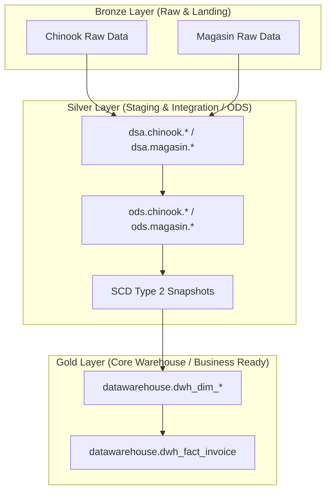

# Chinook & Magasin Modern Data Warehouse Pipeline (dbt + Airflow)

## 🎓 Project Overview & Context

This repository hosts a high-fidelity ELT (Extract, Load, Transform) data warehouse pipeline.

> [!NOTE]
> This is a **university project**; however, the implementation has been scaled and optimized to match professional, industry-grade standards. Instead of simple query scripts or manual database loads, this project deploys a fully containerized pipeline utilizing modern data stack tools—specifically **Apache Airflow**, **dbt (data build tool)**, and **PostgreSQL**—to integrate, clean, trace, and model transactional sales data from two distinct business entities.

The objective of the project is to ingest and unify sales, customer, employee, and product data from:
1.  **Chinook**: A digital media store database (managing media tracks, playlists, albums, and invoices).
2.  **Magasin**: A physical retail store database (managing retail customer transactions).

---

## 🏛️ Architecture & Transformation Flow

The warehouse implementation follows standard multi-layered dimensional modeling practices:



> [!NOTE]
> The pipeline strictly follows the Medallion Architecture (Bronze, Silver, Gold) mapped across enterprise database schemas (DSA, ODS, and Datawarehouse) to ensure clean data separation.

### 1. DSA (Data Staging Area) Layer
*   **Purpose**: Acts as the landing zone for the raw sources. Models are built as simple SQL views. Minimal transformations are applied (e.g. data type casting).
*   **Target Schemas**: `dsa_chinook`, `dsa_magasin`.

### 2. ODS (Operational Data Store) Layer
*   **Purpose**: Integrates and standardizes the staged data. Columns are renamed to standardized `snake_case`, duplicates are resolved, and empty/null strings are sanitized.
*   **Target Schemas**: `ods_chinook`, `ods_magasin`.

### 3. Snapshot (SCD Type 2) Layer
*   **Purpose**: Automatically logs structural changes over time for crucial business actors (such as employee roles, manager relationships, customer contact info, and product pricing) using dbt snapshots.
*   **Target Schemas**: `csd_snapshot_chinook`, `csd_snapshot_magasin`.

### 4. DWH (Core Data Warehouse) Layer
*   **Purpose**: Materializes the final star-schema dimensional model. Dimensions (e.g. `dwh_dim_customer`, `dwh_dim_track`, `dwh_dim_employee`) are generated, and a unified consolidated sales invoice fact table (`dwh_fact_invoice`) maps and aggregates sales across both Chinook and Magasin.
*   **Target Schema**: Materialized directly under the **`datawarehouse`** schema.

### 📊 Warehouse Volume Statistics

Below are the database counts reflecting the fully loaded data warehouse tables within the **`datawarehouse`** schema:

#### 1. Core Table Volumes
| Table Name | Row Count | Description |
| :--- | :--- | :--- |
| **`dwh_dim_customer`** | 295 | Consolidated customer records with SCD Type 2 tracking |
| **`dwh_dim_employee`** | 40 | Consolidated employee and manager hierarchy records |
| **`dwh_dim_track`** | 17,515 | Track catalog dataset including composer, album, and media definitions |
| **`dwh_dim_playlist`** | 90 | Playlist definitions |
| **`dwh_bridge_playlist_track`** | 43,575 | M-N relationship map between playlists and tracks |
| **`dwh_fact_invoice`** | 6,678 | Unified transactional sales invoice line facts |

#### 2. Invoice Fact Breakdown by Source System
| Source System | Row Count | Percentage |
| :--- | :--- | :--- |
| **chinook** | 2,240 | 33.54% |
| **magasin** | 4,438 | 66.46% |
| **Total** | **6,678** | **100.00%** |

---

## 🚀 Key Implementation Highlights

To exceed the typical scope of university projects, the following features have been integrated:
*   **Native Surrogate Keys**: Implemented a custom `generate_surrogate_key` macro to generate secure, hash-based surrogate keys without adding bloated external packages.
*   **SCD Type 2 Historical Fallbacks**: Configured fact table join conditions to fallback and join against the earliest available dimension version if historical invoices are dated prior to the oldest snapshot record.
*   **Clean Schema Routing**: Created custom schema generation macros to override default dbt prefixes, resulting in clean, queryable production namespaces like `datawarehouse`.
*   **Orchestration Isolation**: Every dbt execution step (run, test, snapshot) is scheduled and run as a separate, isolated task inside ephemeral Docker containers controlled by the Airflow Scheduler.
*   **Elementary Data Observability & Postgres Fixes**: Configured the `elementary` observability package to automatically capture metrics, logs, and volume anomalies (e.g. for `dwh_fact_invoice`). Custom macro overrides (`postgres_elementary_temp_tables.sql`) were created to resolve transaction conflicts and permission errors related to temporary relations in PostgreSQL.
*   **Failure-Resilient Telemetry**: Integrated Elementary loader runs as the final step in the Airflow DAG configured with the `all_done` trigger rule, ensuring metadata is successfully stored in the database even when upstream tests fail.

---

## 📁 Repository Directory Structure

```directory
├── dags/                     # Apache Airflow DAG definitions
│   ├── dbt-full-pipeline.py  # Orchestrates full end-to-end dbt stages
│   ├── dbt-ingestion-pipeline.py # Initial database seeding & schema creation
│   └── dbt_operator.py       # Containerized task builder for dbt executions
├── dbt/chinook_dbt/          # dbt Project workspace
│   ├── macros/               # Custom SQL macro functions
│   ├── models/               # SQL modeling scripts (dsa, ods, dwh)
│   ├── snapshots/            # Slowly Changing Dimension definitions
│   └── dbt_project.yml       # dbt project configurations
├── dbt_profiles/             # Local dbt database connection profiles
├── docker-compose.yaml       # Multi-service local environment setup
├── INSTRUCTION.md            # Detailed operations & development guide
└── REQUIREMENTS.md           # WSL 2, Docker, & Python setup requirements
```

---

## 🔍 Elementary Data Observability & Monitoring

Data quality and pipeline health are monitored using the **Elementary Data** dbt package. This captures real-time diagnostic logs and anomalies directly inside the data warehouse:

*   **Database Schema**: All metadata, run histories, and data tests are logged in the `elementary` schema of the database.
*   **Anomaly Detection**: Configured automated volume anomaly checks on the core fact table `dwh_fact_invoice` to monitor volume changes over a daily time-spine.
*   **PostgreSQL Transaction Fixes**: Developed custom macro overrides in `postgres_elementary_temp_tables.sql` to resolve Redshift/Postgres transactional lock issues during temporary table creations.
*   **Fail-Safe Orchestration**: Configured the Airflow DAG (`dbt_run_elementary` task) using the `all_done` trigger rule, ensuring observability reports are updated even if previous model tests fail.

---

## 📐 dbt Semantic Layer (MetricFlow)

To establish a single source of truth for business intelligence, a semantic model layer is configured on top of the consolidated Gold (DWH) schema:

*   **Semantic Model**: Maps the unified fact table `dwh_fact_invoice` including entities (foreign keys for `customer`, `track`, and `employee`) and dimensions (e.g. `source_system` and `invoice_date`).
*   **Global Time Spine**: Registered the project's `date_spine` model as the primary MetricFlow time spine to allow period-over-period and offset calculations.
*   **Exposed Metrics**:
    *   **Simple**: `total_revenue`, `total_units_sold`, and `distinct_orders_count`.
    *   **Ratio**: `average_order_value` (Total Revenue / Distinct Orders).
    *   **Derived (MoM Growth)**: `revenue_growth_rate` calculating the Month-over-Month growth of total revenue.
*   **Downstream BI Routing**: BI tools (like Streamlit or Power BI) query this semantic layer via the dbt Semantic Layer JDBC/GraphQL API Proxy, generating standardized SQL queries on the fly and ensuring formula parity.

---

## 🛠️ Operational Setup Quickstart

1.  **Read the Requirements**: Ensure your WSL 2 and Docker memory settings are configured by reading [REQUIREMENTS.md](file:///d:/04_Code-est-le-pain/401_PROJECTS/chinook-data-warehouse-v2/REQUIREMENTS.md).
2.  **Start the Stack**:
    ```bash
    docker-compose up -d
    ```
3.  **Read Operations Instructions**: For detailed pipeline execution, testing, and manual database querying, refer to [INSTRUCTION.md](file:///d:/04_Code-est-le-pain/401_PROJECTS/chinook-data-warehouse-v2/INSTRUCTION.md).
